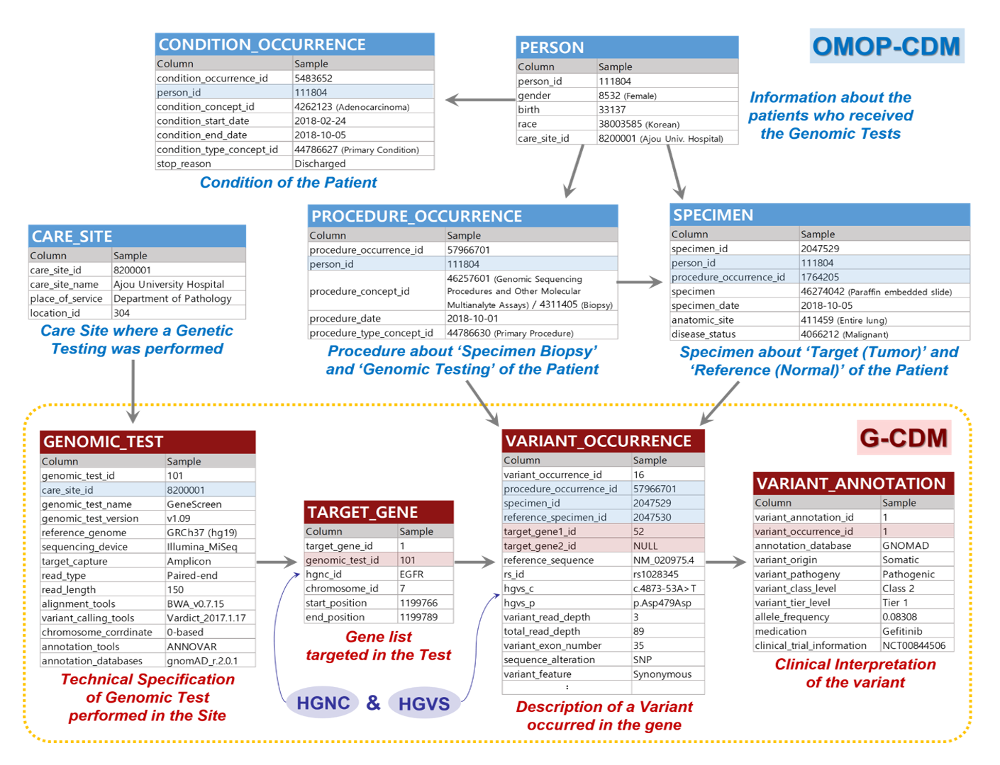

# Genomic-CDM
Repository for development of the genomic module of the CDM. 

**_Genomic-CDM (G-CDM) v2.0 Specifications_**

Welcome to Genomic Common Data Model (G-CDM) Wiki! 
This wiki houses table specifications and related documents of G-CDM for the latest version as well as changes.
You can navigate the pages using the table of contents below.
This wiki is a prototype of the Genomic CDM that is on developing, so please use it for reference purpose.

# Table of Contents
* [GENOMIC_TEST](https://github.com/OHDSI/Genomic-CDM/wiki/GENOMIC_TEST)
* [TARGET_GENE](https://github.com/OHDSI/Genomic-CDM/wiki/TARGET_GENE)
* [VARIANT_OCCURRENCE](https://github.com/OHDSI/Genomic-CDM/wiki/VARIANT_OCCURRENCE)
* [VARIANT_ANNOTATION](https://github.com/OHDSI/Genomic-CDM/wiki/VARIANT_ANNOTATION)
